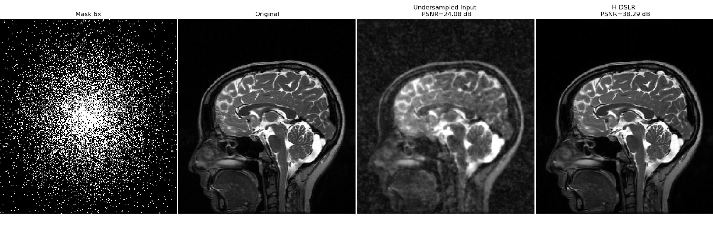

# Deep-SLR : Deep Generalization of Structured Low-Rank Algorithms
Tensorflow implementation of hybrid Deep-SLR (H-DSLR) for undersampled multi-channel MRI reconstruction. H-DSLR is a model-based deep learning approach to significantly
reduce the computational complexity of Structured low-rank (SLR) algorithms.

# Code Details
There are following python scripts:
1. trn.py : Training code for brain MRI.
2. tst.py : Code for testing the trained model on test dataset.
3. auxiliaryFunctions.py : Data preparation functions defined in this script.
4. HDSLR.py : Defined the H-DSLR network architecture to be trained.
